# 🛡️ NEIGHBOT - AI 기반 자율 순찰 로봇 시스템

  

> “Neighborhood + Robot”  
> 생활 속 위험 요소를 감지하고 대응하는 AI 순찰 시스템

# 📚 목차

- [1. 프로젝트 소개](#1-프로젝트-소개)
- [2. 시스템 구조](#2-시스템-구조)
- [3. 주요 기능](#3-주요-기능)
- [4. 핵심 기술](#4-핵심-기술)
- [5. 트러블 슈팅 사례](#5-트러블-슈팅-사례)
- [6. 회고 및 향후 계획](#6-회고-및-향후-계획)
- [7. 기술 스택](#7-기술-스택)
- [8. 팀원 소개](#8-팀원-소개)

---

# 1. 프로젝트 소개
> ⏰ 프로젝트 기간: 2025.05.22 ~ 2025.07.02

  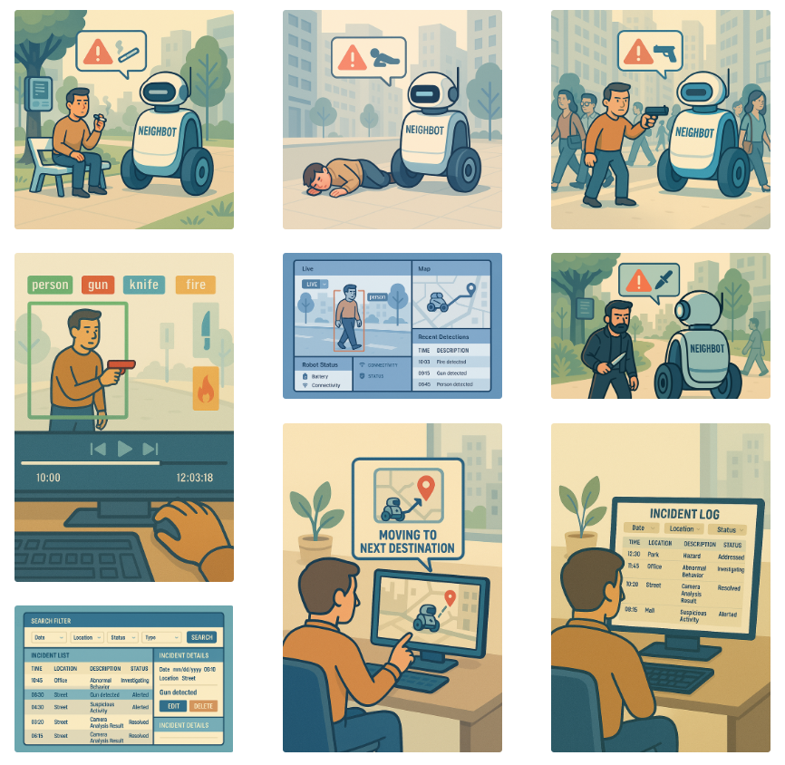

**Neighbot**은 도심 내 사각지대에서 발생할 수 있는 **위험 상황(무기, 쓰러짐, 흡연 등)** 을 실시간으로 감지하고,  
그에 맞는 **알림 및 대응 기능**을 제공하는 **AI 기반 순찰 로봇 제어 시스템**입니다.  

※ 실제 물리적 로봇이 아닌, **로봇을 위한 통합 시스템** 구축이 본 프로젝트의 핵심입니다.

---

# 2. 시스템 구조

## 시스템 아키텍쳐

  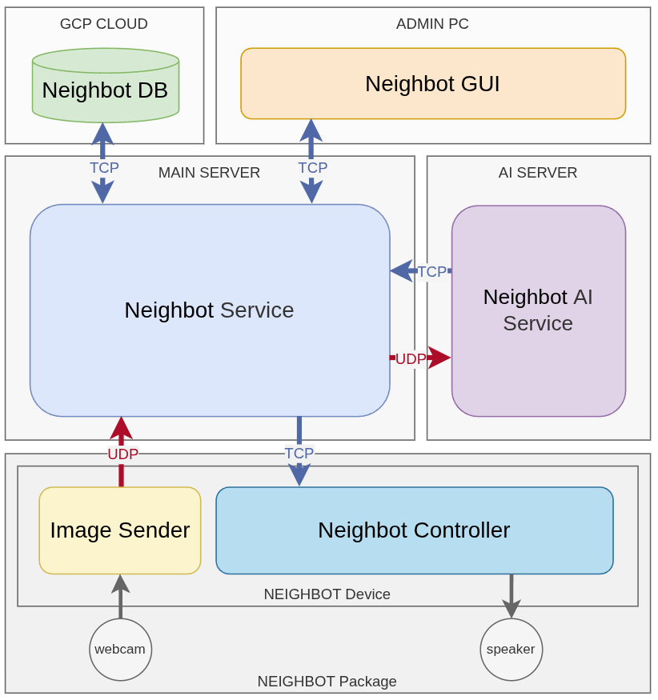

## ER 다이어그램

  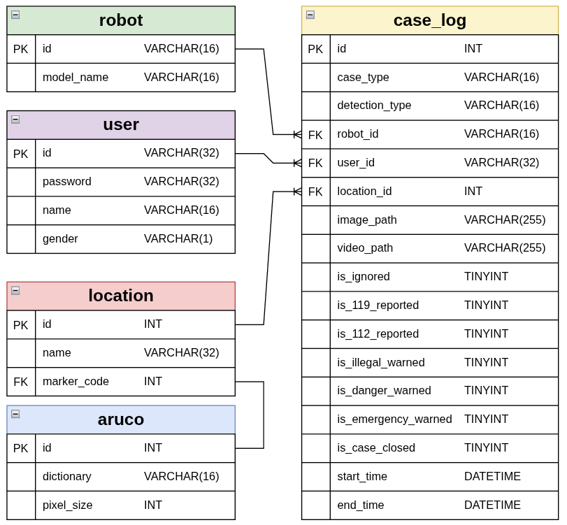

## State 다이어그램

  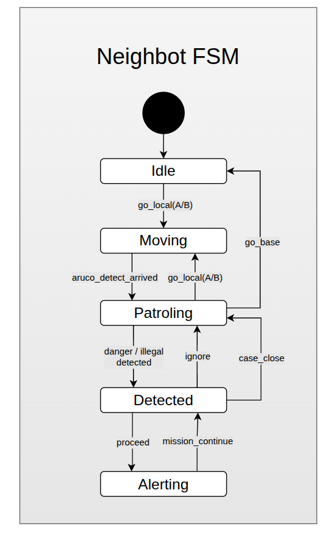

**디렉토리 구조**
- `ai_server/` - YOLO 분석 및 감지 처리
- `main_server/` - 분석 결과 통합, 판단, DB 관리
- `robot/` - 영상 전송 및 명령 수신
- `gui/` - PyQt 기반 사용자 인터페이스
- `shared/` - 메시지 프로토콜 및 유틸리티 모듈

---

# 3. 주요 기능

1. **YOLO 기반 객체 인식 (총, 칼, 담배)**
2. **YOLO Pose 기반 쓰러짐 감지**
3. **GUI 실시간 영상 모니터링 및 경보 대응**
4. **사건 로그 자동 저장 및 조회 기능**
5. **원격 로봇 제어 (이동, 순찰, 복귀 명령)**

## 🎬 주요 기능 시연 (GIF Demo)

| 기능 이름         | 설명                                                                 | 예시 GIF |
|------------------|----------------------------------------------------------------------|----------|
| **📍 로봇 위치 인식** | - 지도 위치 클릭 → 로봇 이동 명령 - 아르코마커 기반 위치 인식 - FSM 상태 표시 |  |
| **🔫 총 감지 기능**   | - YOLO Seg 기반 총기 감지 - 2초 내 40% 프레임 기준 - 불법 무기 감지 시 경보 |  |
| **🔪 칼 감지 기능**   | - YOLO Seg 기반 칼 감지 - 동일 조건 적용 - 흉기 난동 감지 처리              |  |
| **🚬 담배 감지 기능** | - YOLO Obj Detection 기반 담배 탐지 - 금연 구역 감시 - 사용자 알림 송출     |  |
| **🧍‍♂️ 쓰러짐 감지**  | - YOLO Pose 기반 - Lying_down 키포인트 판별 - 응급 상황 판단 및 대응        |  |
| **📢 현장 대응 기능** | - 위협/응급/위법 구분 - 경보음 재생 및 자동 신고 - GUI를 통한 대응 선택    |  |
| **📂 로그 데이터 조회**| - 사건 목록 필터링 및 정렬 기능 - 사건별 영상/이미지 재확인 가능             | 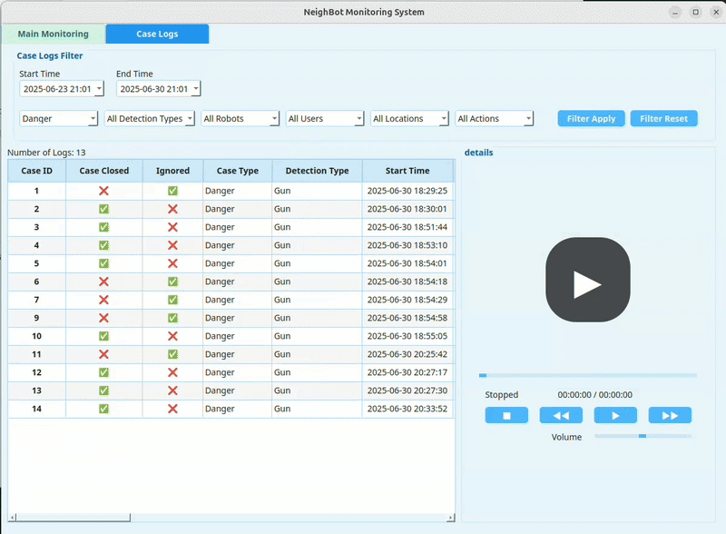 |

---

# 4. 핵심 기술
## 감지 모델 & 사건 종류

| 종류    | 모델           | 자료 이미지          |
|----------|-----------------|---------------------|
| 칼/총       | YOLO Segmentation |  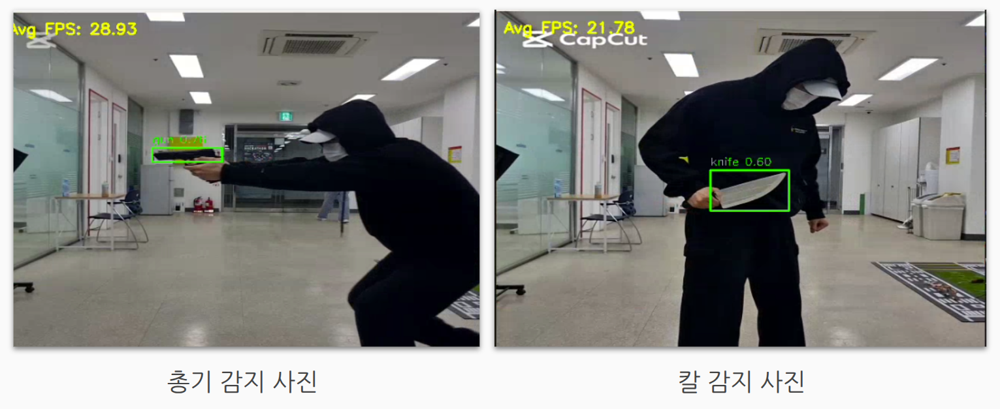 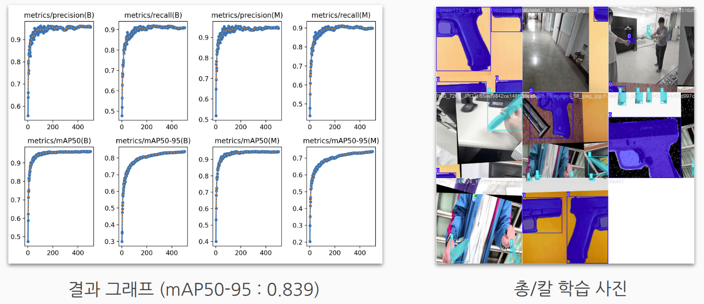    |
| 담배     | YOLO Detection    |  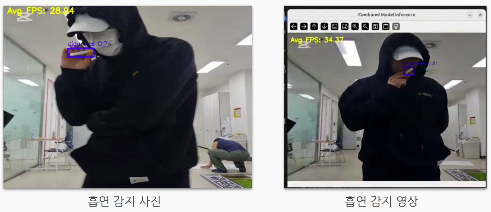 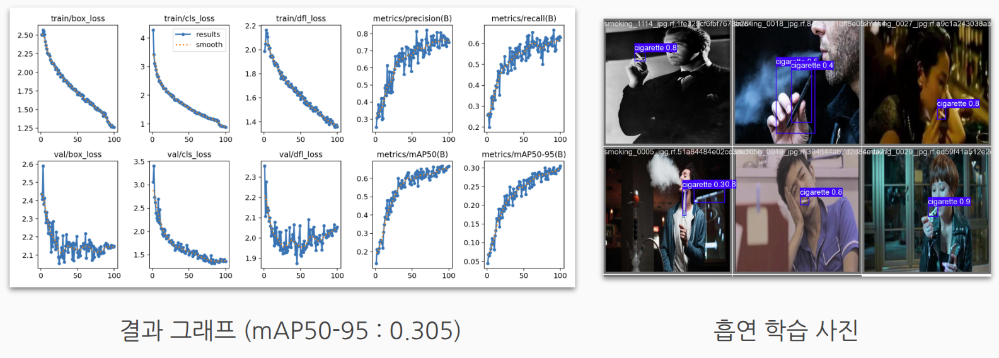          |
| 쓰러짐   | YOLO Pose         |  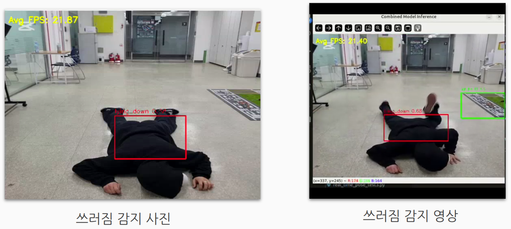 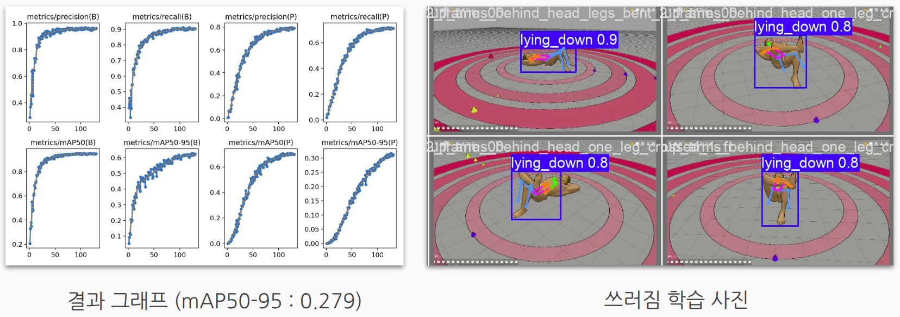|

---

## 판단 알고리즘

단순 "객체 검출"이 아닌, **일정 시간 동안의 프레임 비율과 confidence 값을 종합 판단**하여 상황을 판단하는 알고리즘 적용  
→ False Positive(오탐) 감소, 신뢰도 향상 (왼쪽 - 개선 전, 오른쪽 - 개선 후)

  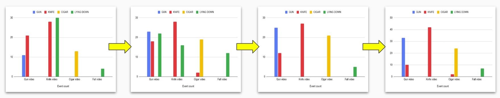

 

    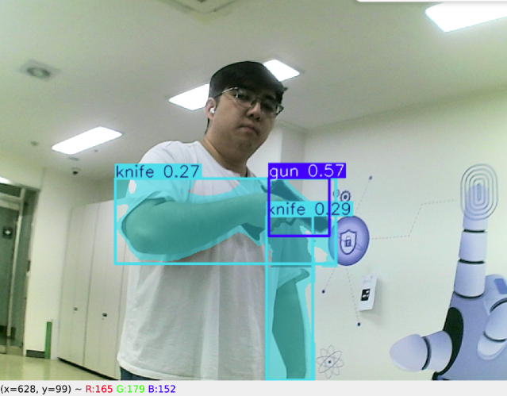
    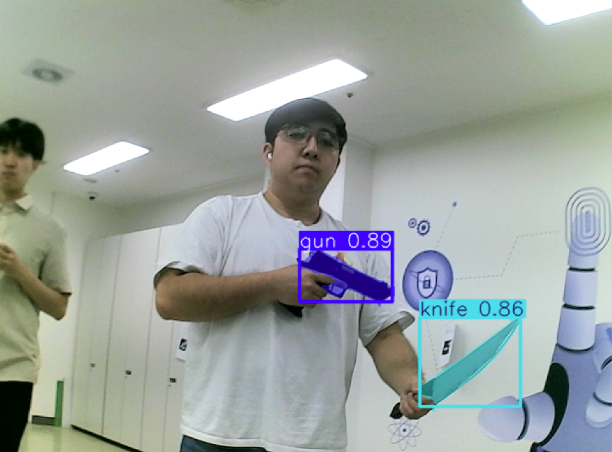
  
  

---

# 5. 트러블 슈팅 사례

- **쓰러짐 감지 성능 저하**
  - 누드 모델 학습 → 옷 입은 사람에 대한 인식률 저하 (왼쪽/오른쪽 이미지)
  - 해결: Skeleton 기반 MLP 모델 결합하여 개선 (아래 이미지)
  

    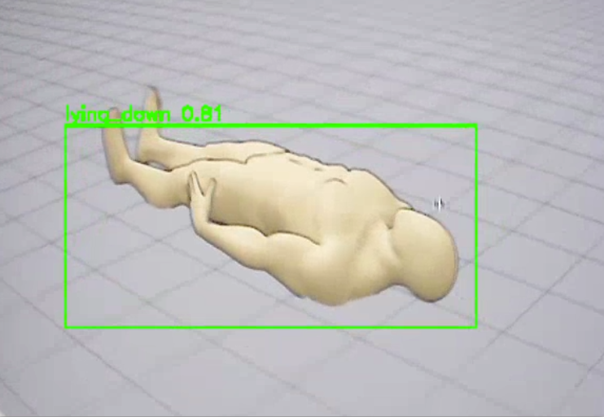
    
  
  

- **스트리밍 지연 현상**
  - 데이터 병합 스레드의 병목 → 과거 프레임 급재생 (위 이미지)
  - 분석 객체에 씌어진 bbox 표시의 버벅거림 (아래 왼쪽 이미지)
  - 해결: Timeout 설정 + 데이터 큐 최적화 + 칼만 필터 (아래 오른쪽 이미지)
  

  
  

  

    
    
  
  

- **YOLO 오탐지 문제**
  - 유사 객체 탐지 / Angle variation 취약 (왼쪽 이미지)
  - 해결: Negative set 강화 + Seg 모델 전환 (오른쪽 이미지)
  

    
    
  
  

---

# 6. 회고 및 향후 계획

- 기술조사 단계가 미흡해 초기 설계 시간이 부족했음
- 딥러닝 모델의 내부 알고리즘 설계 필요성 확인
- Skeleton 기반 판별 모델 및 학습 최적화 지속 예정

---

# 7. 기술 스택

| 분류 | 구성 | |
|------|------|--|
| **운영 체제** | Ubuntu 24.04 |  |
| **개발 언어** | Python 3.10 |  |
| **프레임워크** | YOLOv8, OpenCV |   |
| **UI 프레임워크** | PyQt5 |  |
| **DB** | MySQL (GCP 기반) |  |
| **버전 관리** | Git / GitHub |   |
| **협업 도구** | Jira, Confluence, Slack |    |

---

# 8. 팀원 소개

| 이름     | 역할 | 담당 업무 |
|----------|------|-----------|
| **이건우** (팀장) | 시스템 설계 총괄 | - Neighbot 로봇 시스템 개발 - 문제 상황 판단 알고리즘 개발 - YOLO Segmentation 모델 구현 |
| **박태환** (팀원) | AI 백엔드 개발 | - AI 서버 백엔드 시스템 개발 - YOLO Pose 모델 구현 - YOLO Object Detection 모델 구현 |
| **김민수** (팀원) | GUI & 아키텍처 | - GUI 디자인 및 시스템 개발 - DB 설계 및 구성 - Interface Spec & 통신 규약 설계 - 시스템 아키텍처 도안 |
| **이승훈** (팀원) | 메인 서버 개발 | - Main 서버 백엔드 시스템 개발 - Jira 스케줄 관리 보조 - PyQt GUI 초기 설계 |
| **김대인** (팀원) | 문서 & 테스트 관리 | - Jira 스케줄 & 업무 & 미팅 관리 - 시스템 시나리오 제작 - Confluence 문서 관리 - 연동 테스트 기획 및 진행 - YOLO Pose 모델 학습 보조 |
